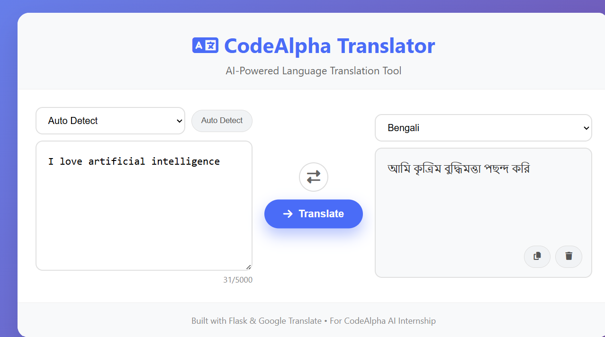

# CodeAlpha Language Translation Tool

A modern, responsive AI-powered language translation web application built as part of the **CodeAlpha Artificial Intelligence Internship**.

## Project Preview



## Features

- Real-time translation using Google Translate via `deep-translator`
- Auto language detection
- Source and target language selection
- Language swap functionality
- Copy translated text to clipboard
- Clear input and output
- Responsive modern user interface
- User-friendly error handling
- Character counter

## Tech Stack

- **Backend:** Python, Flask
- **Translation:** deep-translator
- **Frontend:** HTML5, CSS3, JavaScript
- **Styling:** Custom CSS, Font Awesome icons

## Folder Structure

```text
CodeAlpha_LanguageTranslationTool/
│
├── app.py
├── requirements.txt
├── README.md
│
├── static/
│   ├── style.css
│   └── script.js
│
├── templates/
│   └── index.html
│
└── screenshots/
    └── translator-preview.png